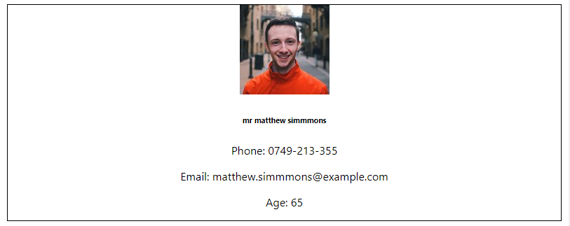

Hi, thank you for taking the time to take this test. The point of this exercise is to get data from [Random User API](https://randomuser.me/documentation) and present it nicely.

NB: At the end of the task we would be thankful if you could send us a brief feedback via email telling us what you thought of this task, what you would have done (and how) if you had more time, what can be improved in your code, ...

We will pay attention to (in order of importance):
* Code clarity
* Usability and user experience
* Mobile and desktop friendliness
* Design

Bare requirements : 
* Request 1,000 profiles from _RandomUser_ and present the data nicely  
    * For every user object, render a card showcasing interesting info about this user (what is deemed interesting is up to you) 
    * An idea of a layout could be rows of 3 cards for desktop and a column for mobile 
* Implement pagination 
    * Dont show the 1,000 profiles on a single page but rather 30 profiles per pages
    * (Or implement loading on scroll if you prefer, the point is to have a fluid user experience)    

Bonus : 
* Tests

You are given basic react app created with _create-react-app_, see below how to run this app.
You can use any library you want, if you need basic components we recommend [Material-UI](https://material-ui.com/)

Example of a user card (feel free to improve the design!)

---

This project was bootstrapped with [Create React App](https://github.com/facebook/create-react-app).

## Available Scripts

In the project directory, you can run:

### `npm install`

Install all the required dependencies.

### `npm start`

Runs the app in the development mode. 
Open [http://localhost:3000](http://localhost:3000) to view it in the browser.

The page will reload if you make edits. 
You will also see any lint errors in the console.

### `npm test`

Launches the test runner in the interactive watch mode. 
See the section about [running tests](https://facebook.github.io/create-react-app/docs/running-tests) for more information.

### `npm run build`

Builds the app for production to the `build` folder. 
It correctly bundles React in production mode and optimizes the build for the best performance.

The build is minified and the filenames include the hashes. 
Your app is ready to be deployed!

See the section about [deployment](https://facebook.github.io/create-react-app/docs/deployment) for more information.

### `npm run eject`

**Note: this is a one-way operation. Once you `eject`, you can’t go back!**

If you aren’t satisfied with the build tool and configuration choices, you can `eject` at any time. This command will remove the single build dependency from your project.

Instead, it will copy all the configuration files and the transitive dependencies (Webpack, Babel, ESLint, etc) right into your project so you have full control over them. All of the commands except `eject` will still work, but they will point to the copied scripts so you can tweak them. At this point you’re on your own.

You don’t have to ever use `eject`. The curated feature set is suitable for small and middle deployments, and you shouldn’t feel obligated to use this feature. However we understand that this tool wouldn’t be useful if you couldn’t customize it when you are ready for it.

## Learn More

You can learn more in the [Create React App documentation](https://facebook.github.io/create-react-app/docs/getting-started).

To learn React, check out the [React documentation](https://reactjs.org/).

### Code Splitting

This section has moved here: https://facebook.github.io/create-react-app/docs/code-splitting

### Analyzing the Bundle Size

This section has moved here: https://facebook.github.io/create-react-app/docs/analyzing-the-bundle-size

### Making a Progressive Web App

This section has moved here: https://facebook.github.io/create-react-app/docs/making-a-progressive-web-app

### Advanced Configuration

This section has moved here: https://facebook.github.io/create-react-app/docs/advanced-configuration

### Deployment

This section has moved here: https://facebook.github.io/create-react-app/docs/deployment

### `npm run build` fails to minify

This section has moved here: https://facebook.github.io/create-react-app/docs/troubleshooting#npm-run-build-fails-to-minify
